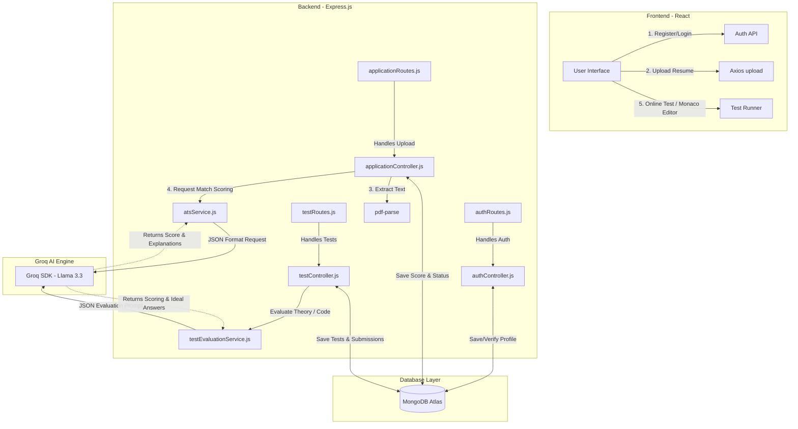

# PROJECT REPORT: SMART JOB TRACKER

## ABSTRACT
The Smart Job Tracker is a full-stack AI-powered recruitment management system developed to simplify and optimize the modern hiring process for both employers and job seekers. Traditional recruitment methods often involve manual resume screening, fragmented application management, delayed communication, and inefficient candidate evaluation, leading to increased hiring time and missed opportunities. This project aims to address these challenges by providing a centralized, intelligent, and automated recruitment platform.

The system enables HR professionals to create and manage job postings, track applications, shortlist candidates, and monitor recruitment progress through a dynamic dashboard. Candidates can search for jobs, apply online, track application status, and receive personalized feedback for resume improvement. One of the key features of the platform is AI-powered resume analysis, where resumes are evaluated against job descriptions using Groq Cloud’s Llama 3 models to generate a Criteria Match Score (CRI) and identify skill gaps.

The application is developed using modern web technologies, with React used for building a responsive and interactive frontend, and Node.js with Express.js used for backend development and API handling. MongoDB is used as the database for storing user profiles, job postings, applications, and AI-generated analysis results. JWT authentication and Role-Based Access Control (RBAC) are implemented to ensure secure access and data protection.

Additionally, the system includes features such as automated offer letter generation, AI-generated interview questions and MCQs, and responsive UI design using Tailwind CSS. Overall, the Smart Job Tracker provides a scalable, secure, and efficient recruitment solution that improves hiring accuracy, enhances candidate experience, and reduces manual workload for recruiters.

---

## Index
1. **Introduction** (Page 03)
   - 1.1 Background
   - 1.2 Objectives
   - 1.3 Significance
   - 1.4 Key Features
   - 1.5 Scope and Future Enhancements
2. **Problem Definition and Requirements** (Page 07)
   - 2.1 Problem Definition
   - 2.2 Goals of Smart Job Tracker
   - 2.3 Functional Requirements
   - 2.4 Hardware & Software Requirements
3. **Proposed Design / Methodology** (Page 09)
   - 3.1 Overview of System Design
   - 3.2 Folder Structure
   - 3.3 Schematic Workflow Diagram
   - 3.4 Methodology
4. **Results** (Page 13)
   - 4.1 Feature Outcomes
5. **References** (Page 16)
6. **Technical Appendix: Core Codebase Files** (Page 18)

---

## 1. INTRODUCTION

### 1.1 Background
The recruitment landscape has undergone a significant transformation over the last decade. Traditional hiring methods, which once relied heavily on manual resume screening and face-to-face networking, are now being replaced by digital recruitment platforms and online job portals. While these platforms have expanded opportunities for both employers and job seekers, they have also introduced new challenges. A single job posting today can receive hundreds or even thousands of applications within a short period of time. Managing such a large volume of resumes manually is not only time-consuming but also prone to human error, inconsistency, and bias.

Large organizations often overcome these challenges by investing in advanced Applicant Tracking Systems (ATS) and AI-driven recruitment tools. However, small and medium-sized enterprises (SMEs) frequently struggle to adopt such technologies due to high implementation costs, technical complexity, and limited HR resources. As a result, many SMEs continue to rely on traditional hiring approaches, which can lead to delayed recruitment cycles, inefficient candidate management, and the possibility of overlooking highly qualified candidates.

Another major issue in the modern hiring ecosystem is the communication gap between employers and applicants. Candidates often remain uninformed about their application status, while recruiters face difficulties in organizing applications, tracking candidate progress, and shortlisting suitable profiles efficiently. This lack of streamlined communication negatively impacts both candidate experience and organizational productivity.

The Smart Job Tracker is designed to address these challenges by offering an accessible, intelligent, and user-friendly recruitment platform powered by Artificial Intelligence (AI). The system automates critical stages of the hiring pipeline, particularly resume screening and candidate ranking, thereby reducing the manual workload on recruiters. Using Natural Language Processing (NLP) and machine learning techniques, the platform analyzes resumes, compares them against job descriptions, identifies relevant skills, and generates match scores that help recruiters quickly identify the most suitable candidates.

In addition to AI-based resume analysis, the platform provides a centralized dashboard where recruiters can manage job postings, monitor applications, track hiring progress, and maintain organized candidate records. For job seekers, the system offers features such as application tracking, profile management, and personalized feedback on missing skills or resume improvements. This creates a more transparent and engaging hiring experience.

The Smart Job Tracker not only improves hiring efficiency but also promotes fair and data-driven recruitment decisions. By minimizing repetitive administrative tasks and enhancing candidate evaluation accuracy, the platform enables organizations—especially SMEs—to compete more effectively in today’s fast-paced talent market. Ultimately, the project aims to simplify recruitment, save time and resources, and create a smarter connection between employers and potential employees.

### 1.2 Objectives
The primary objectives of this project are:
* **To automate the initial screening process:** Using Natural Language Processing (NLP) to evaluate resumes against job descriptions.
* **To centralize application management:** Providing a single repository for all job applications, reducing reliance on fragmented email threads.
* **To enhance candidate experience:** Offering real-time tracking of application status and AI-driven feedback for profile improvement.
* **To provide HR analytics:** Equipping hiring managers with data-driven insights into the quality of the applicant pool and recruitment trends.
* **To facilitate interview preparation:** Automatically generating relevant interview questions and MCQs for specific roles.

### 1.3 Significance
This system is highly beneficial for both employers and candidates in the recruitment process.

#### 1. For Employers
The Smart Job Tracker reduces the Time-to-Hire by automatically filtering unqualified candidates and identifying the best applicants using a Criteria Match Score (CRI). This minimizes manual resume screening, saves time, reduces hiring costs, and helps recruiters make faster and more accurate hiring decisions.

#### 2. For Candidates
The platform makes recruitment more transparent and interactive. Instead of submitting resumes without feedback, candidates receive a match score along with personalized suggestions to improve their resumes, skills, and keyword optimization for future opportunities. This helps applicants better understand job requirements and improve their chances of selection.

### 1.4 Key Features
* **AI-Powered Resume Analysis:**
  The platform integrates with Groq Cloud’s Llama 3 models to intelligently analyze resumes and extract important details such as skills, education, certifications, and work experience. Based on the job description, the system generates a compatibility score that helps recruiters quickly identify the most suitable candidates.
* **Dynamic HR Dashboard:**
  A centralized dashboard is provided for recruiters and HR teams to efficiently manage the hiring process. HRs can create and post job openings, view applicant details, shortlist candidates, and track them through different recruitment stages such as Shortlisted, Interviewed, and Offered.
* **Personalized Candidate Dashboard:**
  Candidates receive a dedicated dashboard where they can search for available jobs, apply instantly with a single click, and monitor the status of their applications in real time. This improves transparency and enhances the overall user experience.
* **Automated Document Generation:**
  The system automatically generates professional offer letters in PDF format using predefined templates. This reduces manual documentation work and ensures consistency in official communication.
* **Interview & Assessment Module:**
  The platform uses AI to generate role-specific Multiple Choice Questions (MCQs) and interview questions based on the technical requirements of a job. This helps recruiters conduct effective assessments and evaluate candidates more efficiently.
* **Responsive Design:**
  The user interface is developed using Tailwind CSS, providing a modern, clean, and responsive design. The platform works smoothly across desktops, tablets, and mobile devices, ensuring accessibility and ease of use for all users.

### 1.5 Scope and Future Enhancements
The current version of the Smart Job Tracker primarily focuses on automating and optimizing the core recruitment lifecycle. However, several advanced features can be integrated in the future to further enhance the platform’s intelligence, security, and efficiency.
* **Video Interview Analysis:**
  Future versions can integrate AI-based video interview analysis to evaluate candidates beyond resumes and written assessments. Using facial expression recognition, speech analysis, and sentiment detection, the system could assess factors such as confidence, communication skills, emotional tone, and engagement during recorded interviews. This would help recruiters gain deeper insights into candidate personality and suitability for a role.
* **Social Platform Integration:**
  The platform can be connected with professional networks such as LinkedIn and GitHub to automatically fetch and verify candidate profiles, technical projects, certifications, and work experience. This integration would provide recruiters with a more complete view of a candidate’s professional background while reducing the chances of false information in resumes.
* **Blockchain-Based Verification:**
  To improve trust and authenticity in recruitment, blockchain technology can be used for secure verification of educational certificates, professional achievements, and employment history. By storing verified credentials on decentralized ledgers, organizations can reduce recruitment fraud and simplify the background verification process. This would create a more reliable and transparent hiring ecosystem for both employers and candidates.

---

## 2. PROBLEM DEFINITION AND REQUIREMENTS

### 2.1 Problem Definition
Traditional recruitment processes face several major challenges that reduce hiring efficiency and negatively affect both recruiters and candidates.
1. **Inefficiency:**
   HR managers often receive hundreds or even thousands of resumes for a single job opening. Due to limited time, recruiters typically spend only 6–10 seconds reviewing each resume. Such quick screening increases the chances of human error, causes qualified candidates to be overlooked, and slows down the overall hiring process. Manual filtering also creates unnecessary workload for HR teams.
2. **Lack of Feedback:**
   In many organizations, candidates rarely receive updates regarding their application status or rejection. This creates frustration and uncertainty among applicants, making the recruitment process feel impersonal and unfair. Poor communication can also damage the employer’s brand image and reduce candidate trust in the organization.
3. **Data Fragmentation:**
   Recruitment data is often scattered across emails, spreadsheets, and multiple platforms, making candidate management difficult. HR teams may struggle to track applications, search previous resumes, or revisit suitable candidates for future roles. This lack of centralized data management leads to disorganization, reduced productivity, and missed hiring opportunities.

### 2.2 Goals of Smart Job Tracker
The Smart Job Tracker is designed to function as a complete and intelligent recruitment management ecosystem that simplifies and streamlines the hiring process for both employers and candidates. The system focuses on improving efficiency, organization, and security throughout the recruitment lifecycle.
* **Maintaining Stateful Recruitment Records:**
  The platform keeps a detailed and continuous record of every interaction between candidates and the organization. This includes job applications, status updates, interview progress, assessments, feedback, and offer details. By maintaining centralized records, recruiters can easily track candidate journeys and manage recruitment activities more effectively.
* **Ensuring Data Security with Role-Based Access Control (RBAC):**
  To protect sensitive recruitment data, the system implements Role-Based Access Control (RBAC). Different users such as administrators, HR managers, and candidates are given specific permissions based on their roles. This ensures that only authorized users can access or modify particular information, improving privacy, security, and system reliability.
* **Reducing Manual Data Entry through Resume Parsing:**
  The platform minimizes repetitive manual work by automatically parsing resumes using AI and Natural Language Processing (NLP). Important details such as skills, education, certifications, and work experience are extracted directly from uploaded resumes and stored in structured form. This automation saves time, reduces human errors, and accelerates the recruitment process.

### 2.3 Functional Requirements
* **Authentication Module:**
  The system provides secure user registration and login functionality using JSON Web Tokens (JWT). During registration, users must choose their role as either Candidate (User) or HR (or Admin), ensuring role-specific access and permissions throughout the platform. This improves both security and user management.
* **Job Management Module:**
  HR professionals can efficiently create, update, and delete job postings through a dedicated management interface. Each job posting contains important details such as company name, job role, description, required skills, and rounds, making the recruitment process more organized and structured.
* **Application & AI Module:**
  Candidates can upload resumes in PDF format directly through the platform. The system automatically extracts resume text using AI-powered parsing techniques and sends the data to the AI service for analysis. Based on the job requirements, the platform generates a CRI (Criteria Match Score) along with personalized suggestions and improvement recommendations, helping both recruiters and candidates make better decisions.
* **Online Assessment & Anti-Cheating Module:**
  Candidates can take MCQs, theory, and programming tests directly on the platform with code compilers supported by a Monaco Editor. The system implements a tab-switch detection module that locks the screen or notes warnings if a candidate tries to switch tabs to search for answers.

### 2.4 Hardware & Software Requirements

#### Hardware Requirements
* **Server Side:** 2.0 GHz Processor, 8GB RAM, 20GB SSD storage.
* **Client Side:** Modern browser (Chrome, Firefox, Safari), 4GB RAM.

#### Software Requirements
* **Operating System:** Cross-platform (Windows/Linux/macOS).
* **Runtime:** Node.js (v20+).
* **Database:** MongoDB Atlas (NoSQL).
* **Frontend Library:** React 19.
* **Styling:** Tailwind CSS 4.
* **AI Engine:** Groq SDK (Llama 3.3 - 70b - versatile).
* **API Testing:** Jest, Postman.

---

## 3. PROPOSED DESIGN / METHODOLOGY

### 3.1 Overview of System Design
* **Frontend (The Client):**
  The frontend of the Smart Job Tracker is developed as a Single Page Application (SPA) using React, providing a fast and interactive user experience. The application uses `react-router-dom` for smooth page navigation without reloading the browser and Axios for sending HTTP requests to the backend API. The responsive interface allows both HRs and candidates to efficiently interact with the platform across multiple devices.
* **Backend (The Server):**
  The backend is built using Express.js, which provides a robust and scalable RESTful API architecture. It manages the core business logic of the application, including authentication, job management, application tracking, resume processing, and AI integration. The server also communicates with third-party AI services to perform resume analysis, generate compatibility scores, and create interview assessments.
* **Database (Storage):**
  The system uses MongoDB as its database solution due to its flexible and document-oriented structure. Since resumes and job-related data can vary significantly in format and content, MongoDB allows efficient storage and management of unstructured and semi-structured data. This flexibility makes it ideal for handling candidate profiles, job postings, application records, and AI-generated analysis results.

### 3.2 Folder Structure (File Architecture)
```
smart-job-tracker/
├── backend/
│   ├── controllers/      # Logic for handling requests (authController, jobController, etc.)
│   ├── middleware/       # Authentication (verifyToken) & role authorization checks
│   ├── models/           # Data definitions (userModel, jobModel, applicationModel, etc.)
│   ├── routes/           # Routing logic mapping URLs to Controllers
│   ├── services/         # Complex logic like AI scoring (atsService) and Question generation
│   ├── utils/            # Shared utilities (Email sending, PDF generation)
│   ├── uploads/          # Temporary storage for uploaded resumes
│   └── server.js         # Server configuration and middleware initialization
├── frontend/
│   ├── src/
│   │   ├── components/   # Reusable UI components (Navbar, Footer, Modal)
│   │   ├── pages/        # Main route components (Login, Dashboard, AIAnalyzer, MeetingRoom)
│   │   ├── utils/        # Global constants and Axios instance (api.js)
│   │   └── App.jsx       # Root component with routing definitions
│   └── vite.config.js    # Optimized build settings
└── .env                  # Sensitive configurations (DB URI, API Keys)
```

### 3.3 Schematic Workflow Diagram



### 3.4 Methodology
1. **Requirement Analysis:**
   The system requirements were analyzed to understand the needs of both recruiters and candidates, including job posting management, resume analysis, candidate tracking, secure authentication, and AI-based recruitment assistance.
2. **System Design:**
   A three-tier architecture was designed consisting of the frontend, backend, and database layers to ensure scalability, maintainability, and efficient data flow throughout the application.
3. **Frontend Development:**
   The user interface was developed using React to provide a dynamic, responsive, and user-friendly experience for both HR professionals and job seekers.
4. **Backend Development:**
   The backend was implemented using Node.js and Express.js to handle server-side operations, business logic, authentication, job management, and API requests.
5. **API Integration:**
   RESTful APIs were developed to enable smooth communication between the frontend and backend systems, ensuring efficient data exchange and application performance.
6. **Database Design:**
   MongoDB was used as the database to efficiently store and manage candidate profiles, resumes, job postings, applications, and AI-generated analysis results.
7. **Authentication and Security:**
   JWT (JSON Web Tokens) and Role-Based Access Control (RBAC) were implemented to ensure secure authentication, authorization, and protected access to sensitive recruitment data.
8. **AI Integration and Resume Analysis:**
   AI services powered by Groq Cloud’s Llama 3 models were integrated to analyze resumes, extract candidate information, calculate CRI scores, and generate personalized suggestions.
9. **Testing and Validation:**
   The system was thoroughly tested to ensure proper functionality, API performance, responsiveness, security, and error handling across different modules.
10. **Deployment and Maintenance:**
    The application was designed and deployed with scalability and future enhancements in mind, allowing easy maintenance, feature updates, and integration of advanced recruitment technologies.

---

## 4. RESULTS

### 4.1 Feature Outcomes

#### Fig 4.1: HR / Recruiter Dashboard
The recruiter interface lists all jobs created. Clicking on applications lists every candidate with their real name, email, applying date, status, current interview round, and the AI-calculated **CRI Score (Criteria Match Score)** out of 100. Recruiters can view candidate details, promote them to the next round, reject them, or generate an offer letter.

#### Fig 4.2: Candidate Application Dashboard
Candidates have a clean tracking dashboard showing the timeline of their active applications. When a candidate submits their resume, they see a progression status: `Applied` -> `Under Review` -> `Assessment / Technical Test` -> `Interview Scheduled` -> `Accepted/Offered`.

#### Fig 4.3: AI Resume Analyzer Page
Candidates can perform a standalone check or application analysis where their uploaded PDF resume is parsed and evaluated. The Llama 3.3 model identifies:
- Matched hard and soft skills.
- Missing skills relative to the job requirements.
- Step-by-step suggestions to improve the resume representation.

#### Fig 4.4: Assessment & Coding Interface
The test module provides a full IDE environment using `@monaco-editor/react`. When candidates write algorithms (e.g. JavaScript code), the system runs the code against test cases in the backend. An automated tab-switch monitor registers event listeners on `visibilitychange` to count tab changes. Exceeding a threshold flags the candidate's submission for potential cheating.

---

## 5. REFERENCES
* **React Official Documentation** – Used for building the frontend Single Page Application (SPA).
* **Express.js Documentation** – Used for backend server development and RESTful API creation.
* **MongoDB Documentation** – Reference for database design and document-oriented storage.
* **Node.js Official Website** – Runtime environment used for backend development.
* **Axios Documentation** – Used for handling HTTP requests between frontend and backend.
* **Tailwind CSS Documentation** – Used for responsive and modern UI design.
* **Groq Cloud API Documentation** – Reference for API integration using Llama 3.3.

---

## 6. TECHNICAL APPENDIX: CORE CODEBASE FILES

This section provides the complete source code files from the project codebase, reflecting the model schemas, route mappings, and AI scoring service implementation.

### 6.1 DATABASE MODELS (SCHEMAS)

#### `backend/models/userModel.js`
```javascript
import mongoose from "mongoose";

const userSchema = new mongoose.Schema({
  name: { type: String, required: true },
  email: { type: String, required: true, unique: true },
  password: { type: String, required: true },
  role: { type: String, enum: ['user', 'hr', 'admin'], default: 'user' },
  is_verified: { type: Boolean, default: false },
  otp: { type: String },
  otp_expires: { type: Date },
  phone: { type: String },
  location: { type: String },
  bio: { type: String },
  hard_skills: { type: [String], default: [] },
  soft_skills: { type: [String], default: [] },
  social_links: { type: Array, default: [] },
  profile_image: { type: String },
  
  // New Profile Fields
  education: [{
    institution: String,
    degree: String,
    board: String,
    marks: String,
    year: String
  }],
  experience: [{
    company: String,
    position: String,
    duration: String,
    description: String
  }],
  projects: [{
    title: String,
    description: String,
    technologies: [String],
    link: String
  }],
  certifications: [{
    title: String,
    organization: String,
    year: String,
    link: String
  }],
  achievements: [{
    title: String,
    description: String
  }],
  custom_sections: [{
    title: String,
    content: String
  }]
}, { timestamps: true });

userSchema.set('toJSON', { virtuals: true });
userSchema.set('toObject', { virtuals: true });

const User = mongoose.model("User", userSchema);
export default User;
```

#### `backend/models/jobModel.js`
```javascript
import mongoose from "mongoose";

const jobSchema = new mongoose.Schema({
  company_name: { type: String, required: true },
  job_role: { type: String, required: true },
  description: { type: String, required: true },
  required_skills: { type: String },
  rounds: { type: String },
  created_by: { type: mongoose.Schema.Types.ObjectId, ref: 'User', required: true },
  status: { type: String, enum: ['open', 'closed'], default: 'open' },
}, { timestamps: true });

jobSchema.set('toJSON', { virtuals: true });
jobSchema.set('toObject', { virtuals: true });

const Job = mongoose.model("Job", jobSchema);
export default Job;
```

#### `backend/models/applicationModel.js`
```javascript
import mongoose from "mongoose";

const applicationSchema = new mongoose.Schema({
  user_id: { type: mongoose.Schema.Types.ObjectId, ref: 'User', required: true },
  job_id: { type: mongoose.Schema.Types.ObjectId, ref: 'Job', required: true },
  resume_path: { type: String },
  cover_letter: { type: String },
  ats_score: { type: String },
  ats_explanation: { type: String },
  ats_suggestions: { type: String },
  current_round: { type: String, default: '0' },
  is_offer_sent: { type: Boolean, default: false },
  status: { type: String, enum: ['applied', 'pending', 'accepted', 'rejected'], default: 'pending' },
  applied_with_profile: { type: Boolean, default: false }
}, { timestamps: true });

applicationSchema.set('toJSON', { virtuals: true });
applicationSchema.set('toObject', { virtuals: true });

const Application = mongoose.model("Application", applicationSchema);
export default Application;
```

#### `backend/models/meetingModel.js`
```javascript
import mongoose from "mongoose";

const meetingSchema = new mongoose.Schema({
  title: { type: String, required: true },
  description: { type: String },
  hr_id: { type: mongoose.Schema.Types.ObjectId, ref: 'User', required: true },
  candidate_id: { type: mongoose.Schema.Types.ObjectId, ref: 'User', required: true },
  job_id: { type: mongoose.Schema.Types.ObjectId, ref: 'Job' },
  scheduled_at: { type: Date, required: true },
  duration: { type: Number, default: 30 }, // in minutes
  type: { type: String, enum: ['audio', 'video', 'both'], default: 'both' },
  status: { type: String, enum: ['scheduled', 'accepted', 'rejected', 'reschedule_requested', 'completed', 'cancelled'], default: 'scheduled' },
  meeting_link: { type: String },
  candidate_response: {
    status: { type: String, enum: ['pending', 'accepted', 'rejected', 'reschedule'], default: 'pending' },
    message: { type: String }
  },
  notes: { type: String },
  is_instant: { type: Boolean, default: false },
  offer: { type: String },
  answer: { type: String },
  callerCandidates: [{ type: String }],
  calleeCandidates: [{ type: String }],
  chatMessages: [{
    sender: { type: String, required: true }, // 'hr' or 'candidate'
    senderName: { type: String, required: true },
    text: { type: String, required: true },
    time: { type: String, required: true }
  }]
}, { timestamps: true });

const Meeting = mongoose.model("Meeting", meetingSchema);
export default Meeting;
```

#### `backend/models/testModel.js`
```javascript
import mongoose from "mongoose";

const testSchema = new mongoose.Schema({
  job_id: { type: mongoose.Schema.Types.ObjectId, ref: 'Job', required: true },
  round_number: { type: Number, required: true },
  title: { type: String, required: true },
  description: { type: String },
  duration: { type: Number, required: true }, // in minutes
  start_time: { type: Date, required: true },
  end_time: { type: Date, required: true },
  questions: [{
    type: { type: String, enum: ['mcq', 'theory', 'code'], required: true },
    question: { type: String, required: true },
    options: [String], // for MCQ
    correct_answer: String, // for MCQ
    test_cases: [{ // for coding questions
      input: String,
      output: String,
      is_hidden: { type: Boolean, default: false }
    }],
    points: { type: Number, default: 1 }
  }],
  show_marks: { type: Boolean, default: false },
  created_by: { type: mongoose.Schema.Types.ObjectId, ref: 'User', required: true }
}, { timestamps: true });

const Test = mongoose.model("Test", testSchema);
export default Test;
```

#### `backend/models/testSubmissionModel.js`
```javascript
import mongoose from "mongoose";

const testSubmissionSchema = new mongoose.Schema({
  test_id: { type: mongoose.Schema.Types.ObjectId, ref: 'Test', required: true },
  user_id: { type: mongoose.Schema.Types.ObjectId, ref: 'User', required: true },
  application_id: { type: mongoose.Schema.Types.ObjectId, ref: 'Application', required: true },
  answers: [{
    question_id: { type: mongoose.Schema.Types.ObjectId, required: true },
    answer: { type: String }, // For MCQ and Theory
    code: { type: String },   // For Coding
    language: { type: String }, // For Coding
    score: { type: Number, default: 0 },
    feedback: { type: String },
    is_correct: { type: Boolean, default: false }
  }],
  tab_switches: { type: Number, default: 0 },
  status: { type: String, enum: ['started', 'submitted', 'cancelled'], default: 'started' },
  total_score: { type: Number, default: 0 },
  max_score: { type: Number, default: 0 },
  started_at: { type: Date, default: Date.now },
  submitted_at: { type: Date }
}, { timestamps: true });

const TestSubmission = mongoose.model("TestSubmission", testSubmissionSchema);
export default TestSubmission;
```

---

### 6.2 BACKEND ROUTES

#### `backend/routes/authRoutes.js`
```javascript
import express from "express";
import multer from "multer";
import { register, login, getProfile, updateProfile, updateProfileImage, verifyRegisterOTP, forgotPassword, resetPassword } from "../controllers/authController.js";
import { verifyToken } from "../middleware/authMiddleware.js";

const upload = multer({ dest: process.env.VERCEL ? "/tmp/uploads" : "uploads/" });
const router = express.Router();

router.post("/register", register);
router.post("/verify-register", verifyRegisterOTP);
router.post("/login", login);
router.post("/forgot-password", forgotPassword);
router.post("/reset-password", resetPassword);
router.get("/profile", verifyToken, getProfile);
router.put("/profile", verifyToken, updateProfile);
router.post("/profile/image", verifyToken, upload.single("image"), updateProfileImage);

export default router;
```

#### `backend/routes/applicationRoutes.js`
```javascript
import express from "express";
import multer from "multer";
import { applyJob, getApplications, getPendingApplications, getMyApplications, acceptApplication, rejectApplication, getApplicationAnalytics, getApplicationDetails, getApplicationHistory, updateApplicationRound, analyzeResume, promoteCandidate, rejectFromAssessment } from "../controllers/applicationController.js";
import { verifyToken } from "../middleware/authMiddleware.js";
import { allowRoles } from "../middleware/roleMiddleware.js";

const upload = multer({ dest: process.env.VERCEL ? "/tmp/uploads" : "uploads/" });
const router = express.Router();

router.post("/", verifyToken, allowRoles("user"), upload.single("resume"), applyJob);
router.get("/", verifyToken, allowRoles("hr"), getApplications);
router.get("/pending", verifyToken, allowRoles("hr"), getPendingApplications);
router.get("/my", verifyToken, getMyApplications);
router.get("/analytics", verifyToken, allowRoles("hr"), getApplicationAnalytics);
router.get("/history", verifyToken, getApplicationHistory);
router.get("/:id", verifyToken, allowRoles("hr"), getApplicationDetails);
router.put("/:id/accept", verifyToken, allowRoles("hr"), acceptApplication);
router.put("/:id/reject", verifyToken, allowRoles("hr"), rejectApplication);
router.put("/:id/promote", verifyToken, allowRoles("hr"), promoteCandidate);
router.put("/:id/reject-assessment", verifyToken, allowRoles("hr"), rejectFromAssessment);
router.put("/:id/round", verifyToken, allowRoles("hr"), updateApplicationRound);
router.post("/analyze", verifyToken, upload.single("resume"), analyzeResume);

export default router;
```

#### `backend/routes/jobRoutes.js`
```javascript
import express from "express";
import { createJob, getJobs, getMyJobs, updateJob, deleteJob, getJobById, getJobPerformance, getSimilarJobs, toggleJobStatus } from "../controllers/jobController.js";
import { verifyToken } from "../middleware/authMiddleware.js";
import { allowRoles } from "../middleware/roleMiddleware.js";

const router = express.Router();

router.post("/", verifyToken, allowRoles("hr"), createJob);
router.get("/", getJobs);
router.get("/my", verifyToken, allowRoles("hr"), getMyJobs);
router.get("/:id", getJobById);
router.get("/:id/performance", verifyToken, allowRoles("hr"), getJobPerformance);
router.get("/:id/similar", getSimilarJobs);
router.put("/:id", verifyToken, allowRoles("hr"), updateJob);
router.put("/:id/toggle-status", verifyToken, allowRoles("hr"), toggleJobStatus);
router.delete("/:id", verifyToken, allowRoles("hr"), deleteJob);

export default router;
```

#### `backend/routes/meetingRoutes.js`
```javascript
import express from "express";
import { verifyToken } from "../middleware/authMiddleware.js";
import { createMeeting, getMyMeetings, updateMeetingStatus, getMeetingByLink, saveSignal, clearSignal, deleteMeeting, sendChatMessage } from "../controllers/meetingController.js";

const router = express.Router();

router.post("/create", verifyToken, createMeeting);
router.get("/my", verifyToken, getMyMeetings);
router.get("/link/:link", verifyToken, getMeetingByLink);
router.put("/status/:meetingId", verifyToken, updateMeetingStatus);
router.delete("/:meetingId", verifyToken, deleteMeeting);
router.put("/link/:link/signal", verifyToken, saveSignal);
router.delete("/link/:link/signal", verifyToken, clearSignal);
router.post("/link/:link/chat", verifyToken, sendChatMessage);

export default router;
```

#### `backend/routes/testRoutes.js`
```javascript
import express from "express";
import { 
  createTest, 
  getJobTests, 
  startTest, 
  updateTabSwitch, 
  submitAnswer, 
  finalizeSubmission, 
  getSubmissionResults,
  findSubmission,
  getHRSubmissions,
  deleteTest,
  runCodeInteractive
} from "../controllers/testController.js";
import { verifyToken } from "../middleware/authMiddleware.js";
import { allowRoles } from "../middleware/roleMiddleware.js";

const router = express.Router();

// HR Routes
router.post("/", verifyToken, allowRoles("hr"), createTest);
router.delete("/:test_id", verifyToken, allowRoles("hr"), deleteTest);
router.get("/job/:job_id", verifyToken, getJobTests);
router.get("/submissions", verifyToken, allowRoles("hr"), getHRSubmissions);
router.get("/find", verifyToken, findSubmission);

// Candidate Routes
router.post("/run", verifyToken, runCodeInteractive);
router.get("/start/:test_id", verifyToken, startTest);
router.put("/tab-switch/:submissionId", verifyToken, updateTabSwitch);
router.post("/answer/:submissionId", verifyToken, submitAnswer);
router.post("/finalize/:submissionId", verifyToken, finalizeSubmission);
router.get("/results/:submissionId", verifyToken, getSubmissionResults);

export default router;
```

---

### 6.3 AI SERVICES INTEGRATION

#### `backend/services/atsService.js`
```javascript
import Groq from "groq-sdk";
import fs from "fs";
import dotenv from "dotenv";
import pdfParse from "./pdfHelper.cjs";

dotenv.config();

export const getATSScore = async (filePath, jd) => {
  try {
    const groq = new Groq({ apiKey: process.env.GROQ_API_KEY });

    // Read file as buffer and pass to standard pdfParse
    const fileBuffer = fs.readFileSync(filePath);
    const data = await pdfParse(fileBuffer);
    const extractedText = data.text || "";

    if (!extractedText) {
      console.warn("No text extracted from PDF");
      return { score: 0, explanation: "Could not extract text from the resume PDF.", suggestions: "Please ensure your resume is a searchable PDF and contains text." };
    }

    const res = await groq.chat.completions.create({
      model: "llama-3.3-70b-versatile",
      messages: [
        {
          role: "system",
          content: `You are an expert HR application evaluator. Analyze the resume against the provided Job Description.
          Return a JSON object with exactly these fields:
          {
            "score": number (0-100),
            "explanation": "summary of matching/missing skills",
            "suggestions": ["suggestion1", "suggestion2"]
          }`
        },
        {
          role: "user",
          content: `Resume:\n${extractedText}\n\nJob Description:\n${jd}`
        }
      ],
      response_format: { type: "json_object" }
    });

    const analysis = JSON.parse(res.choices[0].message.content);
    return { 
      score: analysis.score, 
      explanation: analysis.explanation, 
      suggestions: Array.isArray(analysis.suggestions) ? analysis.suggestions.join('\n') : analysis.suggestions
    };
  } catch (error) {
    console.error("Error in getATSScore using Groq:", error);
    return { score: 0, explanation: "Error during AI evaluation", suggestions: "Please try again later." };
  }
};

export const analyzeResumeDetailed = async (filePath, jd, resumeText = "") => {
  try {
    const groq = new Groq({ apiKey: process.env.GROQ_API_KEY });

    let extractedText = resumeText;
    
    if (!extractedText && filePath) {
      const fileBuffer = fs.readFileSync(filePath);
      const data = await pdfParse(fileBuffer);
      extractedText = data.text || "";
    }

    if (!extractedText) {
      throw new Error("Could not get text from Resume");
    }

    const res = await groq.chat.completions.create({
      model: "llama-3.3-70b-versatile",
      messages: [
        {
          role: "system",
          content: `You are a professional Resume Analyzer. Analyze the resume against the provided Job Description.
          Return a JSON object with exactly these fields:
          {
            "score": number (0-100),
            "hard_skills": ["skill1", "skill2"],
            "soft_skills": ["skill1", "skill2"],
            "missing_skills": ["skill1", "skill2"],
            "suggestions": ["suggestion1", "suggestion2"],
            "summary": "overall summary"
          }`
        },
        {
          role: "user",
          content: `Resume:\n${extractedText}\n\nJob Description:\n${jd}`
        }
      ],
      response_format: { type: "json_object" }
    });

    return JSON.parse(res.choices[0].message.content);
  } catch (error) {
    console.error("Detailed analysis error:", error);
    throw error;
  }
};
```

#### `backend/services/mcqService.js`
```javascript
import Groq from "groq-sdk";
import dotenv from "dotenv";

dotenv.config();

export const generateMCQs = async ({ jobRole, company, jd, count, difficulty }) => {
  try {
    const groq = new Groq({ apiKey: process.env.GROQ_API_KEY });
    
    const context = `Job Role: ${jobRole || "N/A"}\nCompany: ${company || "N/A"}\nJob Description: ${jd || "N/A"}`;
    
    const prompt = `Generate ${count || 5} Multiple Choice Questions (MCQs) for a candidate preparing for an interview or technical assessment.
    The questions should be relevant to the following context:
    ${context}
    
    Difficulty Level: ${difficulty || "Intermediate"}
    
    Return the response as a JSON array of objects, where each object has:
    {
      "question": "string",
      "options": ["A", "B", "C", "D"],
      "correctAnswer": "string (the exact text from one of the options)",
      "explanation": "string explaining why the answer is correct"
    }`;

    const res = await groq.chat.completions.create({
      model: "llama-3.3-70b-versatile",
      messages: [
        {
          role: "system",
          content: "You are an expert technical interviewer and educator. You generate high-quality, relevant MCQs based on job roles and descriptions. Always return valid JSON."
        },
        {
          role: "user",
          content: prompt
        }
      ],
      response_format: { type: "json_object" }
    });

    const content = JSON.parse(res.choices[0].message.content);
    return content.questions || content;
  } catch (error) {
    console.error("Error generating MCQs:", error);
    throw error;
  }
};
```
